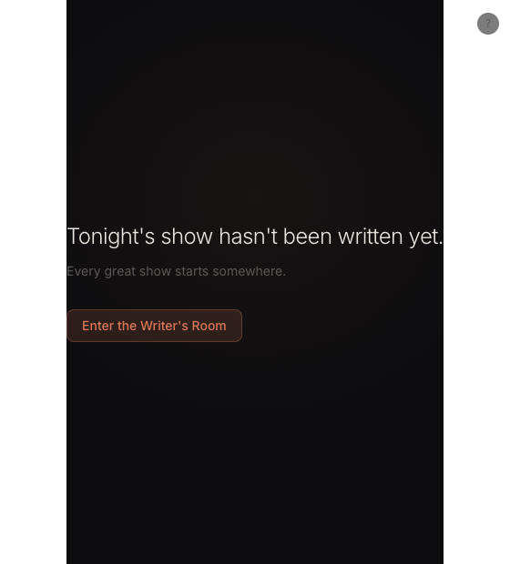
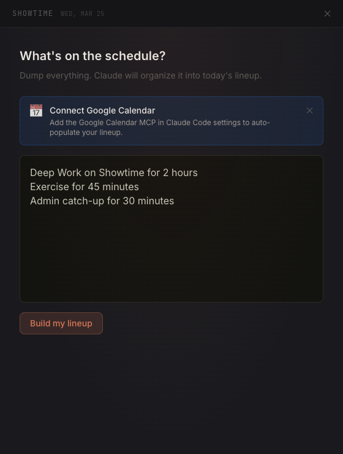
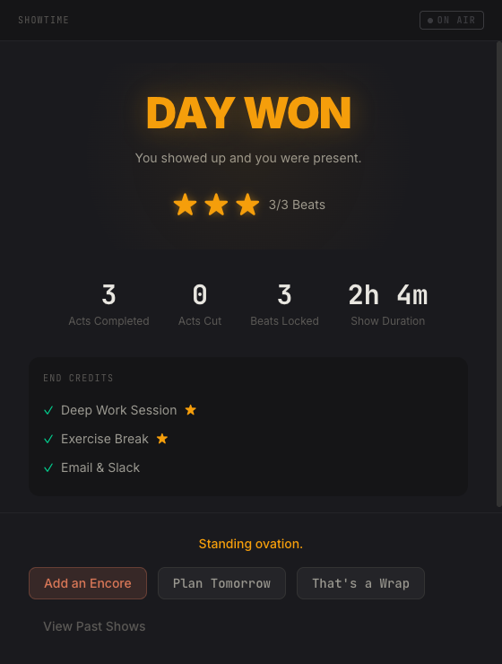
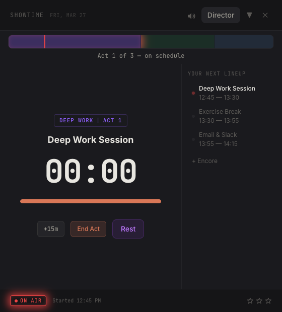

# Showtime

An ADHD-friendly day planner for macOS. Your day is a live TV show. You're the performer.

Showtime turns your task list into a production — with Acts (time-boxed tasks), Beats (moments of presence), and a show that runs from Dark Studio to Strike. No streaks. No guilt. No dead trees. Just a stage, a spotlight, and a Writer's Room that helps you plan what tonight's show looks like.

## The idea

Most productivity apps assume you'll do what you planned. ADHD brains don't work that way. Plans fall apart, energy fluctuates, and guilt from yesterday's incomplete list makes today worse.

Showtime reframes the whole thing. You're not an employee filing task reports. You're a performer on a live variety show. Acts get cut from tonight's broadcast — that's a production decision, not a personal failure. The intermission has no timer because rest is free. And the end-of-day verdict doesn't ask "did you finish everything?" It asks "were you present?"

## How it works

1. **Dark Studio** — the app opens to an empty stage. No backlog, no overdue items. Just a spotlight.
2. **Writer's Room** — pick your energy level, brain dump your tasks, and Claude structures them into a lineup of Acts.
3. **Going Live** — the ON AIR light ignites. You're on stage.
4. **Acts** — time-boxed blocks (45-90 min) with a countdown timer. When time's up, you get a Beat Check: were you present?
5. **Intermission** — rest between Acts. No timer. No guilt.
6. **Strike the Stage** — end-of-day summary with one of four verdicts: DAY WON, SOLID SHOW, GOOD EFFORT, or SHOW CALLED EARLY. None of them is "you failed."

## Screenshots

<p align="center">
  
  
</p>
<p align="center">
  
  
</p>

## Quick start

```bash
git clone https://github.com/vishnujayvel/showtime.git
cd showtime
npm install
npm run dev
```

Requires **macOS** and **Node.js 20+**. The app uses native macOS window APIs (NSPanel) so Linux/Windows aren't supported yet.

## Tech stack

| Layer | What |
|-------|------|
| Shell | Electron 35 + electron-vite |
| UI | React 19, Tailwind CSS v4, shadcn/ui, Framer Motion |
| State | Zustand |
| Data | SQLite (better-sqlite3) |
| AI | Claude Code CLI (plans your lineup from a brain dump) |
| Tests | Vitest (235 unit) + Playwright (115 E2E) |

## View tiers

The window adapts to what you need:

- **Pill** (320x64) — tiny floating capsule with timer and tally light. For when you're in the zone.
- **Compact** (340x140) — act name, timer, beat count.
- **Dashboard** (400x320) — full control room with lineup sidebar.
- **Expanded** (560x620) — hero timer, full lineup, ON AIR bar.

Click the pill to expand. Press Escape to collapse. The show runs either way.

## Documentation

Full docs at [vishnujayvel.github.io/showtime](https://vishnujayvel.github.io/showtime/) (or run `cd docs && npm i && npx vitepress dev` locally).

Covers the framework, the science behind it, all the concepts, and contributor guides.

## The framework

Showtime is built on real research, not just vibes:

- **Ultradian rhythms** — 45-90 minute Acts match natural performance cycles
- **Mindfulness anchors** — Beat Checks are brief presence moments, not productivity metrics
- **Self-compassion** — no guilt language, ever. "That Act got cut from tonight's show" instead of "you failed"
- **Narrative identity** — casting yourself as the performer creates engagement that checklists can't
- **ADHD-specific** — novelty through daily variation, energy-based planning, permission to rest without earning it

More detail in the [framework guide](https://vishnujayvel.github.io/showtime/framework/).

## Scripts

| Command | What it does |
|---------|-------------|
| `npm run dev` | Dev mode with hot-reload |
| `npm run build` | Production build |
| `npm run test` | Vitest unit tests |
| `npm run test:e2e` | Playwright E2E tests (build first) |

## Credits

Forked from [Clui CC](https://github.com/lcoutodemos/clui-cc) by [@lcoutodemos](https://github.com/lcoutodemos).

## License

[MIT](LICENSE)
