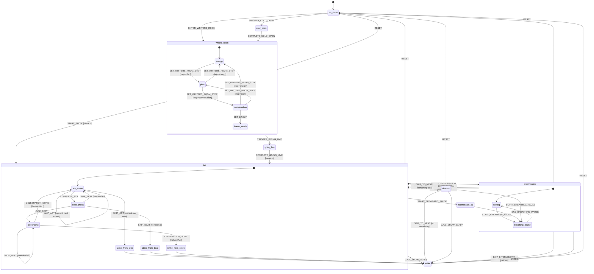
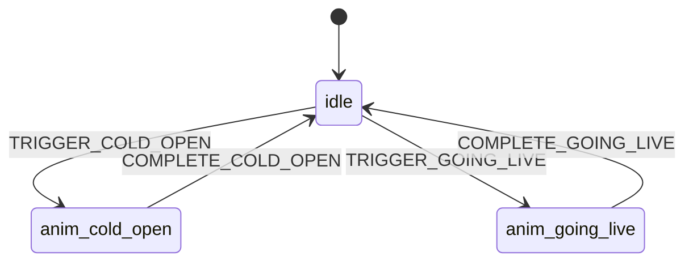

# Show Machine — State Diagram

Visual reference for the XState v5 show machine (`src/renderer/machines/showMachine.ts`).

The machine is **parallel** with two regions: **phase** (main lifecycle) and **animation** (transition effects).

## Phase Region

## Animation Region (parallel)

## Global Events (available across multiple phases)

| Event | Available In | Effect |
|-------|-------------|--------|
| `SET_VIEW_TIER` | All phases (phase root) | Updates `viewTier` context |
| `REORDER_ACT` | writers_room, live, intermission | Reorders act in lineup |
| `REMOVE_ACT` | writers_room, live, intermission | Removes act from lineup |
| `ADD_ACT` | writers_room, live, intermission | Adds act to lineup |
| `EXTEND_ACT` | live (parent) | Adds time to current timer |

## Guards

| Guard | Condition |
|-------|-----------|
| `hasActs` | `context.acts.length > 0` |
| `hasCurrentAct` | `context.currentActId !== null` |
| `hasNextAct` | `findNextUpcoming(acts) !== undefined` |
| `noNextAct` | `findNextUpcoming(acts) === undefined` |
| `hasTimerRunning` | `context.timerEndAt !== null` |
| `hasPausedTimer` | `context.timerPausedRemaining !== null && context.currentActId !== null` |

## Notes

- The machine is **parallel** (`type: 'parallel'`): `phase` and `animation` regions run independently.
- Animation region syncs with phase on `TRIGGER_COLD_OPEN`/`COMPLETE_COLD_OPEN` and `TRIGGER_GOING_LIVE`/`COMPLETE_GOING_LIVE`.
- `LOCK_BEAT`/`SKIP_BEAT` are restricted to `beat_check` and `celebrating` substates — they do NOT fire from `act_active`.
- `SET_ENERGY` is handled in the `energy` substate only. `SET_LINEUP` transitions from `conversation` → `lineup_ready`. `SET_WRITERS_ROOM_STEP` uses guarded transitions in each substate to enforce sequential flow.
